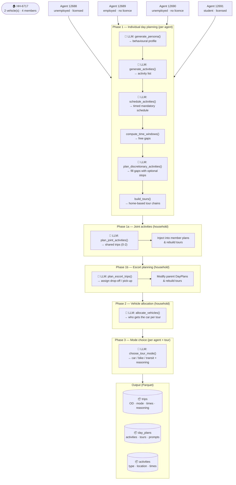
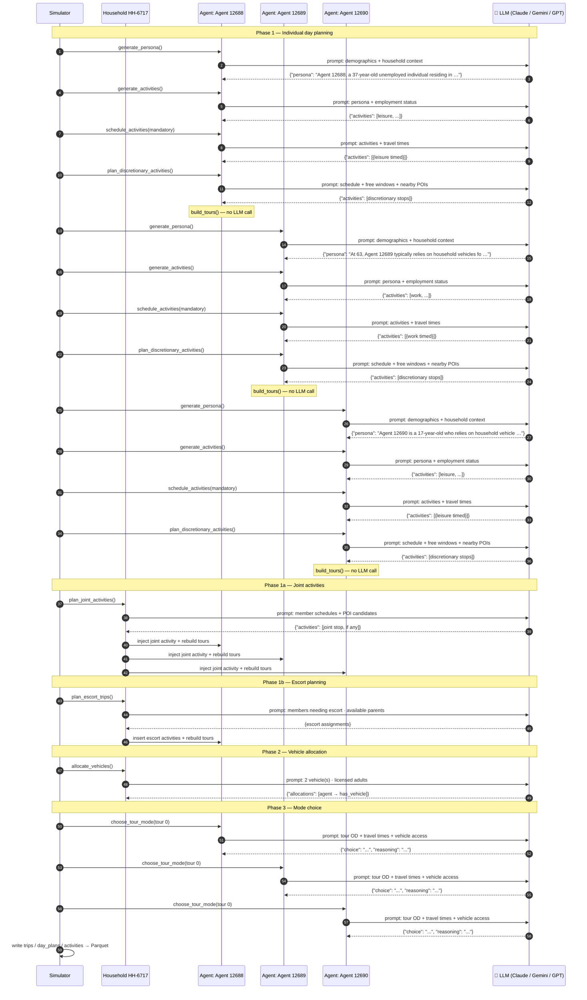

# AIBM — LLM-Based Agent-Based Travel Demand Model

> Every behavioural decision in this model — persona, activity
> list, schedule, destination, and mode — is made by an LLM via a
> structured JSON prompt.  The diagrams and examples below walk
> through one household's day from start to finish.
>
> **Data source:** real output from the Walcheren simulation run.
> Regenerate with `python generate_diagram.py`.

---

## Household used in the examples

| | Agent 12688 | Agent 12689 | Agent 12690 | Agent 12691 |
|---|---|---|---|---|
| Age | 37 | 63 | 17 | 50 |
| Employment | unemployed | employed | unemployed | student |
| Licence | ✓ | — | — | ✓ |

**Household HH-6717:** 2 vehicle(s) · medium income · home zone E0314N3883

---

## 1 · Simulation phases



---

## 2 · End-to-end sequence for household HH-6717



---

## 3 · Example LLM interactions

Each step below shows the exact prompt sent to the language model
and the structured JSON it returns.  Prompts are taken directly
from the simulation run; responses are reconstructed from the
parsed output.  Focus agent: **Agent 12689** (age 63, employed).

### 3.1 Persona generation (Agent 12689)

**Prompt sent to LLM**

```
You are creating a behavioural profile for Agent 12689.
Demographics:
Age: 63
Employment: employed
Has driving licence: no
Home zone: E0314N3883
Household vehicles: 2
Household income: medium

Write a 1-2 sentence persona describing this person's travel habits, preferences, and daily routine. Be specific and grounded in the demographics above.
```

**LLM response (structured JSON)**

```json
{
  "persona": "At 63, Agent 12689 typically relies on household vehicles for transportation, as they do not hold a driving license; this suggests a preference for flexible and familiar travel within their home zone E0314N3883. They likely plan their daily routine around public transport or the availability of household drivers, with activities centered around nearby amenities and community events, balancing mobility with a medium household income that influences their choices."
}
```

### 3.2 Activity list (Agent 12689)

**Prompt sent to LLM**

```
You are Agent 12689, planning your day.
Background:
Age: 63
Employment: employed
Has driving licence: no
Home zone: E0314N3883
Work zone: E0330N3906
Persona: At 63, Agent 12689 typically relies on household vehicles for transportation, as they do not hold a driving license; this suggests a preference for flexible and familiar travel within their home zone E0314N3883. They likely plan their daily routine around public transport or the availability of household drivers, with activities centered around nearby amenities and community events, balancing mobility with a medium household income that influences their choices.

Only include out-of-home activities. Include mandatory activities: work if you are employed, school if you are a student. Also include any discretionary activities. For each activity specify whether it has a flexible time (is_flexible true) or is fixed (is_flexible false). Work and school are always fixed (is_flexible false).
Allowed activity types: eating_out, escort, leisure, personal_business, school, shopping, work.
```

**LLM response (structured JSON)**

```json
{
  "activities": [
    {
      "type": "work",
      "is_flexible": false
    },
    {
      "type": "leisure",
      "is_flexible": true
    },
    {
      "type": "shopping",
      "is_flexible": true
    },
    {
      "type": "eating_out",
      "is_flexible": true
    }
  ]
}
```

### 3.3 Schedule mandatory activities (Agent 12689)

**Prompt sent to LLM**

```
You are Agent 12689, scheduling your day.
Background:
Age: 63
Employment: employed
Has driving licence: no
Home zone: E0314N3883
Work zone: E0330N3906
Persona: At 63, Agent 12689 typically relies on household vehicles for transportation, as they do not hold a driving license; this suggests a preference for flexible and familiar travel within their home zone E0314N3883. They likely plan their daily routine around public transport or the availability of household drivers, with activities centered around nearby amenities and community events, balancing mobility with a medium household income that influences their choices.

Activities to schedule:
- work (flexible: no)

Suggested minimum durations:
- work: 360–540 min (6–9 h)


Assign a start_time and end_time (as HH:MM strings, e.g. "08:00") to each activity. Ensure each activity starts at least as late as the previous activity's end_time plus the travel time to reach it. Fixed activities have realistic fixed hours; flexible ones fill the remaining time. Return them in chronological order.
```

**LLM response (structured JSON)**

```json
{
  "activities": [
    {
      "type": "work",
      "start_time": "09:00",
      "end_time": "15:00"
    }
  ]
}
```

### 3.4 Plan discretionary activities (Agent 12689)

**Prompt sent to LLM**

```
You are Agent 12689, planning the rest of your day.
Background:
Age: 63
Employment: employed
Has driving licence: no
Home zone: E0314N3883
Work zone: E0330N3906
Persona: At 63, Agent 12689 typically relies on household vehicles for transportation, as they do not hold a driving license; this suggests a preference for flexible and familiar travel within their home zone E0314N3883. They likely plan their daily routine around public transport or the availability of household drivers, with activities centered around nearby amenities and community events, balancing mobility with a medium household income that influences their choices.

Your day in order:
  06:00  Day starts — you are at home.
  09:00  Work starts.
  15:00  Work ends.
  23:00  You must be home no later than this.

Free time gaps:
  Gap A: 06:00–08:55 (175 min) — depart from E0314N3883, arrive at E0330N3906
  Gap B: 15:05–23:00 (475 min) — depart from E0330N3906, arrive at E0314N3883

=== Example (different agent — for reference only) ===
Emma (38, employed) works 08:30–16:30.
Free gaps:
  Gap A: 06:00–08:15 (135 min) — depart from home, arrive at work
  Gap B: 16:45–23:00 (375 min) — depart from work, return home

Emma wants to plan: shopping, eating_out.

Correct plan:
  shopping   → Gap B · 16:50–17:35 · supermarket near work
    Reasoning: Morning gap is too short. Stopping for groceries on the
    way home from wo

[… truncated for brevity]
```

**LLM response (structured JSON)**

```json
{
  "activities": [
    {
      "type": "leisure",
      "destination_id": "2907836459",
      "start_time": "09:00",
      "end_time": "10:30"
    },
    {
      "type": "shopping",
      "destination_id": "2908032462",
      "start_time": "13:00",
      "end_time": "13:45"
    },
    {
      "type": "eating_out",
      "destination_id": "809228755",
      "start_time": "19:00",
      "end_time": "20:00"
    }
  ]
}
```

### 3.5 Mode choice — Agent 12689's first tour

**Prompt sent to LLM**

```
You are Agent 12689, deciding how to travel today.
Background:
Age: 63
Employment: employed
Has driving licence: no
Home zone: E0314N3883
Work zone: E0330N3906
Persona: At 63, Agent 12689 typically relies on household vehicles for transportation, as they do not hold a driving license; this suggests a preference for flexible and familiar travel within their home zone E0314N3883. They likely plan their daily routine around public transport or the availability of household drivers, with activities centered around nearby amenities and community events, balancing mobility with a medium household income that influences their choices.
Household vehicles: 2
Household income: medium

Available options:
- bike: 11.969098369074857 minutes
- walk: 43.364666709697595 minutes
- transit: 35.81368377696199 minutes

Pick exactly one mode. Respond with:
- "reasoning": a short personal story (2-3 sentences) explaining your choice.
- "choice": the mode name exactly as listed above.
```

**LLM response (structured JSON)**

```json
{
  "choice": "bike",
  "reasoning": "Today, while I would usually prefer to be driven or take transit, I felt like a bike ride would be refreshing. It's a lovely day, and I could use the exercise to boost my mood and stay active. Plus, riding the bike will get me to work faster than walking and avoids the hassle of bus schedules."
}
```

### 3.6 Vehicle allocation (household)

**Prompt sent to LLM**

```
You are deciding vehicle access for a household.

This household has 1 vehicle(s) for 2 licensed adults.

Members and their tours:
- Agent 14103 (id=a5bd03e6-5177-4fdc-bc62-c151f5d9db3d), age 59, employed, persona: Agent 14103, a 59-year-old employed individual with a medium household income, typically drives their household's single vehicle for daily commutes and errands, preferring to navigate the local area around E0310N3885. They enjoy taking weekend getaways, often exploring nature or visiting family, and prioritize convenience and comfort in their travel plans.
  Tour 0: E0310N3885 → E0310N3885 (car 6 min, bike 12 min, walk 55 min, transit 139 min)
- Agent 14104 (id=8e98b088-8f0f-4a08-9e9b-c97192035b86), age 82, retired, persona: At 82 years old, Agent 14104 enjoys the flexibility of a retired lifestyle, often taking leisurely drives in their sole household vehicle through their local area, with a preference for scenic routes that allow for short excursions to nearby parks or community centers. Daily routines include moderate physical activity such as walks or gardening, supplemented by regular visits to the grocery store and occasional trips to visit family, ensuring a balanced blend of independence and social connection.
  Tour 0: E0310N3885 → E0310N3885 (car 4 min, bike 7 min, walk 32 min, transit 42 min)

Assign vehicle access (true/false) to each member for each tour

[… truncated for brevity]
```

**LLM response (structured JSON)**

```json
{
  "allocations": [
    {
      "agent_id": "Agent 14103",
      "tour_idx": 0,
      "has_vehicle": true,
      "reasoning": "Needs the car for the work commute."
    },
    {
      "agent_id": "Agent 14104",
      "tour_idx": 0,
      "has_vehicle": false,
      "reasoning": "Leisure trips are manageable by bike."
    }
  ]
}
```

---

## 4 · What makes this approach powerful

* **No hand-coded rules** — behavioural heterogeneity emerges from
  the LLM's world knowledge conditioned on demographics and context.
* **Traceable reasoning** — every decision comes with a `reasoning`
  field, making the model interpretable by design.
* **Any LLM back-end** — swap Claude, Gemini, or GPT by changing
  one config value; the `LLMClient` protocol keeps the rest of the
  code identical.
* **Rich context** — prompts include land-use labels, POI names,
  real travel times, and household dynamics that would be painful
  to encode in traditional utility functions.
* **Incremental refinement** — improving a decision step means
  editing a prompt template, not retraining a model.

---

## 5 · How to regenerate this document

```bash
# Install pipeline dependencies (pandas, pyarrow, snakemake, …)
uv sync --group pipeline

# Run the full Walcheren pipeline (produces the parquet files)
uv run snakemake --cores 1 -s workflow/Snakefile

# Regenerate this diagram document
python generate_diagram.py
```
