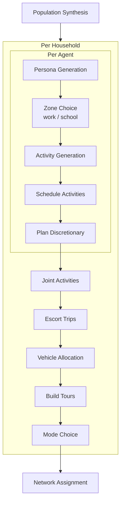

# aibm

An agent-based travel demand model that replaces traditional discrete
choice models (logit, nested logit) with LLM prompts. Each synthetic
agent is given a persona and asked — via structured LLM calls — to
choose a work/school location, generate activities, schedule them,
pick destinations, and select travel modes. The result is a full set
of daily trip chains that can be assigned to a road network.

## Prerequisites

- Python 3.12+
- [uv](https://docs.astral.sh/uv/) package manager
- An API key for at least one supported LLM provider

This project uses LLMs to power agent decisions. It supports four providers:

- [Gemini API](https://aistudio.google.com/) (default)
- [Anthropic API](https://platform.claude.com/)
- [OpenAI API](https://platform.openai.com/)
- [xAI Grok API](https://console.x.ai/)

Set the API key for the provider you want to use:

```sh
# For Gemini (default)
export GEMINI_API_KEY=your_key_here

# For Anthropic
export ANTHROPIC_API_KEY=your_key_here

# For OpenAI
export OPENAI_API_KEY=your_key_here

# For xAI Grok
export XAI_API_KEY=your_key_here
```

To make this permanent, add the line to your shell config (e.g. `~/.bashrc` or `~/.zshrc`).

The provider is selected automatically based on the model name. Names starting
with `claude` use Anthropic; names starting with `gpt-`, `o1`, or `o3` use
OpenAI; names starting with `grok-` use xAI; everything else uses Gemini:

```python
from aibm import Agent

# Uses Gemini (default)
agent = Agent(name="Alice")

# Uses Anthropic
agent = Agent(name="Alice", model="claude-sonnet-4-20250514")

# Uses OpenAI
agent = Agent(name="Alice", model="gpt-4o")

# Uses xAI Grok
agent = Agent(name="Alice", model="grok-4-1")
```

## Quick start

```sh
# Install all dependencies (package + pipeline + dev tools)
uv sync --group pipeline

# Set your API key
export OPENAI_API_KEY=your_key_here

# Run the full pipeline (download data, synthesize population, simulate, assign)
uv run snakemake --cores 1 -s workflow/Snakefile
```

## Development setup

Install the package in editable mode with dev tools:

```sh
uv sync
```

Run tests:

```sh
uv run pytest
```

Run a script:

```sh
uv run python scripts/example.py
```

## LLM costs

Rough estimates for simulating 200 households (~500 agents) on the
Walcheren example model:

| Model | Approximate cost | Notes |
|-------|-----------------|-------|
| `gpt-4o-mini` | ~$0.50–1.00 | Recommended for development |
| `gemini-2.5-flash-lite` | ~$0.30–0.80 | Good budget option |
| `gpt-4o` | ~$5–10 | Higher quality, much more expensive |
| `claude-sonnet-4-20250514` | ~$5–10 | Similar to gpt-4o |

Costs depend on prompt complexity and number of discretionary activities
generated. The `n_households` setting in `workflow/config.yaml` controls
sample size.

## Notebooks

To work with the Jupyter notebooks, install the notebooks group:

```sh
uv sync --group notebooks
```

Launch JupyterLab:

```sh
uv run jupyter lab
```

The `notebooks/` directory contains hands-on explorations of the model components:

- **synthetic_population.ipynb** — manually build a small population of zones, households, and agents

## Lint and format

```sh
uv run ruff check src tests
uv run ruff format src tests
```

Activate pre-commit hooks (runs ruff automatically on every `git commit`):

```sh
uv run pre-commit install
```

## Architecture



## Example model

The package is used to develop an example model for the Walcheren
region in the Netherlands. Walcheren consists of municipalities
Middelburg, Veere and Vlissingen.

### Input data

* Demographic data for population synthesis from
  [CBS Vierkantstatistieken](https://download.cbs.nl/vierkant/100/2025-cbs_vk100_2024_v1.zip).
  Place the zip in `data/raw/`.

### Running the pipeline

Install the pipeline dependencies and run Snakemake:

```sh
uv sync --group pipeline
uv run snakemake --cores 1 -s workflow/Snakefile
```

The pipeline steps are:

1. **download_boundaries** — fetch Walcheren municipality
   polygons from PDOK
2. **filter_grid** — spatial-filter CBS 100m grid to Walcheren
3. **clean** — handle anonymisation, remap age groups, derive
   household size distributions
4. **build_specs** — convert cleaned data to ZoneSpec objects
5. **synthesize** — generate synthetic population

Output lands in `data/processed/walcheren_population.parquet`.

### Providers and iterations

The pipeline is built around a **2D matrix** of providers and iterations.
A *provider* is an LLM model configuration. An *iteration* is a set of
prompt overrides — a named experiment round. Snakemake computes the full
cross-product and runs each combination as a separate scenario.

```
providers × iterations  →  scenarios
─────────────────────────────────────
gpt_4o_mini   × baseline       → gpt_4o_mini__baseline
gpt_4o_mini   × v1_trip_rate   → gpt_4o_mini__v1_trip_rate
claude_haiku  × baseline       → claude_haiku__baseline
claude_haiku  × v1_trip_rate   → claude_haiku__v1_trip_rate
...
```

Scenario outputs are named `{name}_assigned_trips_{provider}__{iteration}.parquet`.
Expensive shared steps (network, population synthesis, POIs) run once and
are reused across all scenarios.

#### Directory layout

```
workflow/
├── config.yaml           # lists which providers and iterations to run
├── providers/            # one YAML per LLM model
│   ├── gpt_4o_mini.yaml
│   ├── claude_haiku_4_5.yaml
│   ├── gemini_2_0_flash.yaml
│   └── ...
├── iterations/           # one YAML per experiment round
│   ├── baseline.yaml
│   └── v1_trip_rate.yaml
└── prompt_configs/       # reusable prompt snippets, included by iterations
    └── trip_rate_fix.yaml
```

#### Provider YAMLs (`workflow/providers/`)

Each file sets the model name, rate limit, and any other simulation
overrides specific to that model. Example:

```yaml
# workflow/providers/gpt_4o_mini.yaml
simulation:
  model: gpt-4o-mini
  rate_limit_rpm: 500
```

The optional `only_iterations` field restricts a provider to a subset of
iterations. This is useful for providers you want to use as a secondary
reference (e.g. a different random seed) without running every iteration:

```yaml
# workflow/providers/gpt_4o_mini_seed2.yaml
only_iterations: [baseline]   # skip v1_trip_rate, v2, etc.
simulation:
  model: gpt-4o-mini
  seed: 99
```

#### Iteration YAMLs (`workflow/iterations/`)

Each file defines a prompt experiment round. The baseline is empty — it
applies no overrides on top of the base config:

```yaml
# workflow/iterations/baseline.yaml
{}
```

A non-baseline iteration includes prompt overrides. These can be inlined
directly, or pulled in from a reusable `prompt_configs/` file via
`include_prompt_configs`:

```yaml
# workflow/iterations/v1_trip_rate.yaml
include_prompt_configs:
  - trip_rate_fix          # loaded from workflow/prompt_configs/trip_rate_fix.yaml

simulation:
  prompts:
    discretionary:
      instructions: |
        Before planning each activity, ask: "Would I really go out for
        this today, or can it wait until another day?" ...
```

The merge order is: base config → provider YAML → included prompt configs
→ inline iteration overrides. Later values win on conflict.

#### Prompt configs (`workflow/prompt_configs/`)

Reusable prompt snippets that can be shared across multiple iterations.
A prompt config contains a `prompts:` block using the same structure as
`simulation.prompts` in `config.yaml`:

```yaml
# workflow/prompt_configs/trip_rate_fix.yaml
prompts:
  activities:
    instructions: |
      Plan only the activities you would genuinely do on this specific
      day — not everything you might do over the course of a week.
      ...
```

#### Configuring the matrix in `workflow/config.yaml`

The `providers:` and `iterations:` lists at the bottom of the file
control what gets run:

```yaml
providers:
  - gpt_4o_mini
  - gpt_4o_mini_seed2    # has only_iterations: [baseline]
  - claude_haiku_4_5
  - gemini_2_0_flash

iterations:
  - baseline
  - v1_trip_rate
```

#### Adding a new provider

1. Create `workflow/providers/my_model.yaml`:
   ```yaml
   simulation:
     model: gpt-4o
     rate_limit_rpm: 60
   ```
2. Set the relevant API key (see prerequisites above).
3. Add `my_model` to the `providers:` list in `workflow/config.yaml`.
4. Run the pipeline — Snakemake picks up the new provider and runs it
   for every iteration in the `iterations:` list.

#### Adding a new iteration (prompt experiment)

1. Create `workflow/iterations/v2_my_fix.yaml`:
   ```yaml
   include_prompt_configs:
     - trip_rate_fix       # reuse an existing snippet if needed

   simulation:
     prompts:
       activities:
         instructions: |
           Your custom instruction here.
   ```
2. Add `v2_my_fix` to the `iterations:` list in `workflow/config.yaml`.
3. Run the pipeline — every provider now gets a `{provider}__v2_my_fix`
   scenario automatically.

#### Running partial subsets

You never have to change the config to run only part of the matrix.
Target specific output files directly on the Snakemake command line:

```sh
# One specific combination
uv run snakemake --cores 1 -s workflow/Snakefile \
  data/processed/walcheren_assigned_trips_gpt_4o_mini__v1_trip_rate.parquet

# All providers for one iteration
uv run snakemake --cores 1 -s workflow/Snakefile \
  data/processed/walcheren_assigned_trips_gpt_4o_mini__v1_trip_rate.parquet \
  data/processed/walcheren_assigned_trips_claude_haiku_4_5__v1_trip_rate.parquet \
  data/processed/walcheren_assigned_trips_gemini_2_0_flash__v1_trip_rate.parquet

# One provider across all iterations
uv run snakemake --cores 1 -s workflow/Snakefile \
  data/processed/walcheren_assigned_trips_gpt_4o_mini__baseline.parquet \
  data/processed/walcheren_assigned_trips_gpt_4o_mini__v1_trip_rate.parquet

# Only the comparison plots (once data exists)
uv run snakemake --cores 1 -s workflow/Snakefile \
  data/processed/walcheren_mode_shares.png
```

#### Comparison plots

Three plots are generated automatically as part of the pipeline. Each
reads all scenarios from the matrix and facets by provider and iteration:

| Script | What it shows |
|--------|---------------|
| `plot_mode_shares.py` | Mode share (%) per provider, faceted by iteration |
| `plot_trip_lengths.py` | Trip distance distributions, rows = provider, columns = mode, iterations overlaid |
| `plot_trips_per_person.py` | Trips-per-person histogram, one panel per provider, iterations overlaid |

Run them manually with:

```sh
uv run python workflow/scripts/plot_mode_shares.py \
  --config workflow/config.yaml \
  --output data/processed/walcheren_mode_shares.png
```

## Web app

Visualise simulation results on an interactive map.

**Prepare the data** (converts pipeline parquet output to JSON for the browser):

```sh
# For the baseline scenario (default)
uv run python webapp/prepare_data.py --config workflow/config.yaml

# Or for a specific scenario
uv run python webapp/prepare_data.py --config workflow/config.yaml --scenario gpt4o
```

The app is fully static — open `webapp/static/index.html` directly in your
browser, or serve it with any static file server:

```sh
# Python's built-in server
cd webapp/static && python -m http.server 8000
```

Then open http://localhost:8000 in your browser.

To customise the app content, edit these two files:

- `webapp/static/content/about.md` — article shown in the "About this project" overlay
- `webapp/static/config.json` — GitHub and LinkedIn URLs shown as icon links in the sidebar

**Deployment:** The `webapp/static/` directory is deployed as-is to Cloudflare Pages.
