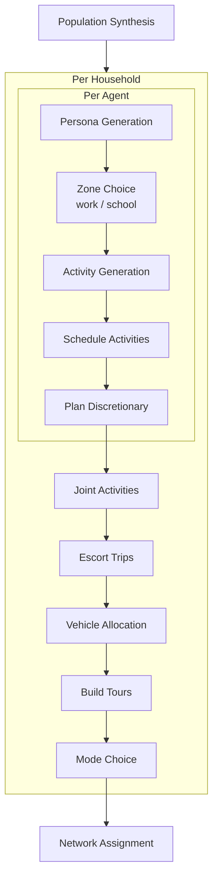

# aibm

An agent-based travel demand model that replaces traditional discrete
choice models (logit, nested logit) with LLM prompts. Each synthetic
agent is given a persona and asked — via structured LLM calls — to
choose a work/school location, generate activities, schedule them,
pick destinations, and select travel modes. The result is a full set
of daily trip chains that can be assigned to a road network.

## Prerequisites

- Python 3.12+
- [uv](https://docs.astral.sh/uv/) package manager
- An API key for at least one supported LLM provider

This project uses LLMs to power agent decisions. It supports four providers:

- [Gemini API](https://aistudio.google.com/) (default)
- [Anthropic API](https://platform.claude.com/)
- [OpenAI API](https://platform.openai.com/)
- [xAI Grok API](https://console.x.ai/)

Set the API key for the provider you want to use:

```sh
# For Gemini (default)
export GEMINI_API_KEY=your_key_here

# For Anthropic
export ANTHROPIC_API_KEY=your_key_here

# For OpenAI
export OPENAI_API_KEY=your_key_here

# For xAI Grok
export XAI_API_KEY=your_key_here
```

To make this permanent, add the line to your shell config (e.g. `~/.bashrc` or `~/.zshrc`).

The provider is selected automatically based on the model name. Names starting
with `claude` use Anthropic; names starting with `gpt-`, `o1`, or `o3` use
OpenAI; names starting with `grok-` use xAI; everything else uses Gemini:

```python
from aibm import Agent

# Uses Gemini (default)
agent = Agent(name="Alice")

# Uses Anthropic
agent = Agent(name="Alice", model="claude-sonnet-4-20250514")

# Uses OpenAI
agent = Agent(name="Alice", model="gpt-4o")

# Uses xAI Grok
agent = Agent(name="Alice", model="grok-4-1")
```

## Quick start

```sh
# Install all dependencies (package + pipeline + dev tools)
uv sync --group pipeline

# Set your API key
export OPENAI_API_KEY=your_key_here

# Run the full pipeline (download data, synthesize population, simulate, assign)
uv run snakemake --cores 1 -s workflow/Snakefile
```

## Development setup

Install the package in editable mode with dev tools:

```sh
uv sync
```

Run tests:

```sh
uv run pytest
```

Run a script:

```sh
uv run python scripts/example.py
```

## LLM costs

Rough estimates for simulating 200 households (~500 agents) on the
Walcheren example model:

| Model | Approximate cost | Notes |
|-------|-----------------|-------|
| `gpt-4o-mini` | ~$0.50–1.00 | Recommended for development |
| `gemini-2.5-flash-lite` | ~$0.30–0.80 | Good budget option |
| `gpt-4o` | ~$5–10 | Higher quality, much more expensive |
| `claude-sonnet-4-20250514` | ~$5–10 | Similar to gpt-4o |
| `claude-haiku` | ~$3.60 | |


Costs depend on prompt complexity and number of discretionary activities
generated. The `n_households` setting in `workflow/config.yaml` controls
sample size.

## Notebooks

To work with the Jupyter notebooks, install the notebooks group:

```sh
uv sync --group notebooks
```

Launch JupyterLab:

```sh
uv run jupyter lab
```

The `notebooks/` directory contains hands-on explorations of the model components:

- **synthetic_population.ipynb** — manually build a small population of zones, households, and agents

## Lint and format

```sh
uv run ruff check src tests
uv run ruff format src tests
```

Activate pre-commit hooks (runs ruff automatically on every `git commit`):

```sh
uv run pre-commit install
```

## Architecture



## Example model

The package is used to develop an example model for the Walcheren
region in the Netherlands. Walcheren consists of municipalities
Middelburg, Veere and Vlissingen.

### Input data

* Demographic data for population synthesis from
  [CBS Vierkantstatistieken](https://download.cbs.nl/vierkant/100/2025-cbs_vk100_2024_v1.zip).
  Place the zip in `data/raw/`.

### Running the pipeline

Install the pipeline dependencies and run Snakemake:

```sh
uv sync --group pipeline
uv run snakemake --cores 1 -s workflow/Snakefile
```

The pipeline steps are:

1. **download_boundaries** — fetch Walcheren municipality
   polygons from PDOK
2. **filter_grid** — spatial-filter CBS 100m grid to Walcheren
3. **clean** — handle anonymisation, remap age groups, derive
   household size distributions
4. **build_specs** — convert cleaned data to ZoneSpec objects
5. **synthesize** — generate synthetic population

Output lands in `data/processed/walcheren_population.parquet`.

### Scenarios

The pipeline runs a full cross-product of three independent dimensions.
Expensive shared steps (network download, grid processing, population
synthesis) run once; skim matrices are shared across providers and
iterations but are rebuilt per policy; `simulate` and `assign_network`
re-run for every scenario combination.

#### Scenario dimensions

| Dimension | Directory | Controls |
|-----------|-----------|----------|
| **Provider** | `workflow/providers/` | LLM model, API key, rate limits |
| **Iteration** | `workflow/iterations/` | Prompt variants and simulation settings |
| **Policy** | `workflow/policies/` | Network/infrastructure interventions |

Scenario IDs are `{provider}__{iteration}__{policy}` (double-underscore
separator). Output files are suffixed with the full ID, e.g.
`walcheren_assigned_trips_gpt_4o_mini__baseline__baseline.parquet`.

Config is merged in order — base → provider → iteration → policy — so
policy overrides take highest priority.

**Active scenarios** are controlled by three lists in `workflow/config.yaml`:

```yaml
providers:
  - gpt_4o_mini
  - claude_haiku_4_5

iterations:
  - baseline

policies:
  - baseline
```

The pipeline runs every valid combination. Providers can opt out of
specific iterations via `only_iterations:` in their provider YAML.

#### Adding a prompt variant (iteration)

1. Create `workflow/iterations/my_variant.yaml` (can override any
   `simulation:` key or include shared prompt configs):
   ```yaml
   simulation:
     prompts:
       mode_choice: "..."
   ```
2. Add `my_variant` to the `iterations:` list in `workflow/config.yaml`.

#### Adding a policy

Policies model real-world transport interventions by overriding network
or transit config. Any key from `workflow/config.yaml` can be overridden.

1. Create `workflow/policies/my_policy.yaml`:
   ```yaml
   # Example: e-bike adoption raises cycling speed by 30 %
   network:
     bike_speed_kmh: 23.4
   ```
2. Add `my_policy` to the `policies:` list in `workflow/config.yaml`.

The pipeline will automatically rebuild the affected skim matrices and
re-run all provider×iteration combinations under the new policy.

The `baseline` policy ships with an empty YAML (no overrides) and must
always be present.

## Web app

Visualise simulation results on an interactive map.

**Prepare the data** (converts pipeline parquet output to JSON for the browser):

```sh
# For a specific scenario (provider__iteration__policy)
uv run python webapp/prepare_data.py \
    --config workflow/config.yaml \
    --scenario gpt_4o_mini__baseline__baseline
```

The app is fully static — open `webapp/static/index.html` directly in your
browser, or serve it with any static file server:

```sh
# Python's built-in server
cd webapp/static && python -m http.server 8000
```

Then open http://localhost:8000 in your browser.

To customise the app content, edit these two files:

- `webapp/static/content/about.md` — article shown in the "About this project" overlay
- `webapp/static/config.json` — GitHub and LinkedIn URLs shown as icon links in the sidebar

**Deployment:** The `webapp/static/` directory is deployed as-is to Cloudflare Pages.
